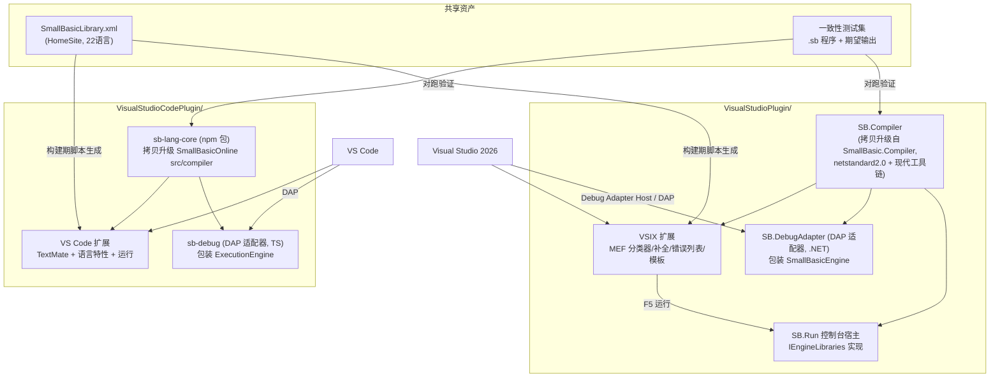

# 02 技术选型与总体架构

## 1. 决策问题

用户提出的选型问题：**dotnet 与 JS 运行时，二选一还是两者都支持？**

拆解为两个子决策：

1. **语言智能**（着色/补全/悬停/诊断）用什么运行时承载？
2. **编译运行与调试**用什么引擎承载？

## 2. 候选方案对比

### 方案 A：双宿主原生复用（推荐）

VS Code 插件复用 TS 编译器（SmallBasicOnline），VS 插件复用 .NET 编译器（SmallBasicEditor），各自在宿主进程内直接调用，调试各自实现 DAP 适配器。

| 维度 | 评估 |
|---|---|
| 性能 | **最优**：进程内调用，无 IPC；编译是微秒~毫秒级同步调用 |
| 代码复用 | 两套编译器都**已存在且有测试**，复用率最高 |
| 部署 | 最简单：VS Code 扩展是纯 JS 单包；VSIX 是纯 .NET 程序集 |
| 维护成本 | 语言演进需改两处（但 SB 语言已冻结多年，风险低） |
| 行为一致性 | 有风险 → 用共享一致性测试集对冲（见 07） |

### 方案 B：单一 .NET 核心 + LSP/DAP 服务，两端共享

把 `SmallBasic.Compiler` 现代化为 net8.0，包成 LSP 服务器；VS Code 扩展做 LSP 客户端，VS 2026 走 `Microsoft.VisualStudio.LanguageServer.Client`。

| 维度 | 评估 |
|---|---|
| 性能 | 差于 A：JSON-RPC IPC + 序列化开销；冷启动多一个进程 |
| 代码复用 | 单核维护友好，但 TS 编译器资产被废弃 |
| VS 侧可行性 | **差**：VS 的 LSP 客户端扩展点能力有限且生态冷门；语法着色分类器仍需 MEF 原生代码，无法绕开 |
| 部署 | VS Code 扩展需捆绑 .NET 运行时或要求用户安装，包体积与首装体验变差 |

### 方案 C：单一 TS 核心，两端共享

VS 侧用 JS 引擎（如通过 Jint/Node 子进程）跑 TS 编译器。

| 维度 | 评估 |
|---|---|
| VS 侧可行性 | **差**：VS 扩展进程（.NET Framework 4.8）内嵌 JS 引擎有互操作与性能问题；MEF 分类器每次击键跨语言调用不可行 |
| 结论 | 否决 |

### 决策：**采用方案 A**

理由：

1. 两套编译器均已功能完整、带测试，**分别在目标宿主的母语运行时下**——这是历史代码给的天然禀赋。
2. 性能最优（语言服务全在进程内，无序列化）。
3. VS 的编辑器扩展（分类器、补全）无论如何都要写原生 MEF 代码，LSP 无法省掉这部分工作量。
4. Small Basic 语言语法已多年冻结，双实现的发散风险主要落在**库行为**，用共享一致性测试集覆盖。
5. 调试协议（DAP）层面统一：VS 2026 内置 **Debug Adapter Host**，可直接挂载 VS Code 风格的调试适配器，因此调试 UX 两端一致。

## 3. 总体架构

## 4. 关键架构决策记录（ADR）

### ADR-1 语言核心：双引擎原生复用
见第 2 节。VS Code 侧将 `SmallBasicOnline/src/compiler` 抽取为独立 npm 包 `sb-lang-core`（升级至 TS 5.x，去除 React/Monaco 依赖——`services/` 本就与 Monaco 解耦，抽取成本低）。VS 侧以 git 子模块方式直接编译 `SmallBasic.Compiler` + `SmallBasic.Utilities`。

### ADR-2 调试协议：DAP 统一，双适配器实现
两端各写一个 DAP 调试适配器（TS 版包 TS 引擎，.NET 版包 .NET 引擎）。VS 2026 通过内置 Debug Adapter Host 消费 .NET 适配器，避免编写 AD7 调试引擎（工作量减少约一个数量级）。断点在适配器层实现（引擎原生支持行级暂停钩子）。详见 [05-调试架构设计.md](./05-调试架构设计.md)。

### ADR-3 不引入 LSP
VS Code 侧语言特性在扩展进程内直接调用编译器（功能等价、性能更好、少一个进程）；若未来出现第三方编辑器需求，再基于 `sb-lang-core` 包一层 LSP 服务器即可，核心代码零改动。

### ADR-4 源码消费方式：拷贝出子模块 + 升级现代化（不使用子模块引用）

两个子模块的源码**拷贝**到插件仓库内独立维护，并升级适配最新编译器/运行时/IDE。不以 git 子模块方式直接引用。理由：

1. 上游仓库（sb/SmallBasic-Online、sb/smallbasic-editor）已 6+ 年停更，无同步需求；拷贝后可自由重构。
2. 旧工程锁定过期工具链（.NET Core SDK 2.1.816 / TypeScript 2.5.3 / webpack 3），在现代 IDE 与 CI 上无法直接构建，**必须升级**，升级改动不应污染子模块。
3. 插件的发布物必须是自包含的（vsix / VSIX 单包），拷贝内置消除外部依赖。

拷贝时在每个目标目录记录 `UPSTREAM.md`（来源仓库 URL + 提交哈希 + 拷贝日期 + 本地改动摘要），保留追溯能力。

**拷贝与升级清单**：

| 源 | 拷贝到 | 拷贝范围 | 升级内容 |
|---|---|---|---|
| `SmallBasicOnline/src/compiler` + `tests/compiler` | `VisualStudioCodePlugin/packages/sb-lang-core` | 全部（syntax/binding/emitting/runtime/services/utils） | TypeScript 2.5.3 → **5.x**；namespace 模块 → **ESM**；jasmine 2.8 → **vitest**；tslint → **eslint 9 + prettier**；pubsub-js 保留或换 Node `EventEmitter`；目标运行时 **Node 20 LTS**（VS Code 1.96+ 内置）；`strict` 渐进开启 |
| `SmallBasicEditor/Source/SmallBasic.Compiler` + `SmallBasic.Utilities` + `SmallBasic.Tests` | `VisualStudioPlugin/src/SB.Compiler`、`SB.Utilities`、`tests/SB.Compiler.Tests` | 全部 .cs + resx + 生成用 XML | 旧式 csproj → **SDK 风格**；目标框架保持 **netstandard2.0**（VS 进程内 net48 与 net8.0 宿主通吃，可选多目标 `netstandard2.0;net8.0` 让 RunHost/Adapter 用新 BCL）；`LangVersion=latest` + 启用 `Nullable` 注解（渐进）；StyleCop 1.0.2/FxCop → **Microsoft.CodeAnalysis.NetAnalyzers + .editorconfig**；测试 netcoreapp2.0 → **net8.0**，xunit 2.3.1 → 2.9.x，FluentAssertions 5.4.1 → 7.x |

**不拷贝**：`SmallBasic.Editor`（Blazor 0.7 UI）、`SmallBasic.Server`、`SmallBasic.Bridge`（Electron 桥）、`SmallBasic.Client`（webpack/TS 前端）、`SmallBasic.Analyzers`（仓库自用风格分析器）、SmallBasicOnline 的 `src/app`、`electron`、`build`。这些与插件无关或已被新宿主取代；`Bridge`/`Editor/Libraries` 仅作为宿主库实现的**阅读参考**。

**升级验证门禁**：升级完成以"既有测试套件在新工具链下全绿 + 一致性测试集通过"为唯一验收，功能零改动（纯工程化升级，不改语言语义）。

### ADR-5 双后端可选：运行/调试后端可配置（TS / .NET 二选一）

两端 IDE 的**语言智能固定用原生后端**（VS Code 用 TS 引擎、VS 用 .NET 引擎，性能最优），但**运行与调试的后端做成可配置选项**——每个 IDE 都能选择用 TS 引擎或 .NET 引擎执行/调试当前 `.sb` 文件：

- 统一 **CLI 契约**：两个后端各自提供独立的命令行宿主与调试适配器——
  - JS 后端：`sb-run`（Node 20，`sb-lang-core` 打包产物）+ `sb-debug`（TS DAP 适配器）
  - .NET 后端：`SB.RunHost.exe`（net8.0 自包含单文件）+ `SB.DebugAdapter.exe`（.NET DAP 适配器）
  - 契约相同：`run <file.sb>` 走 stdin/stdout 交互；`debug` 走 stdio 上的 DAP。
- **默认原生后端**：VS Code 默认 `ts`，VS 2026 默认 `dotnet`；设置项切换（VS Code：`smallbasic.backend: "ts" | "dotnet"`；VS：工具→选项→Small Basic→执行后端）。
- **备选后端的投递**：非原生后端作为**可选组件**——VS Code 侧默认不捆绑两个 .NET exe（约 +40~60MB），首次切换时按需下载或提示安装配套组件；VS 侧 TS 后端捆绑 `sb-run` 单文件 JS + 复用系统 Node（未检测到则引导安装 Node 20 LTS）。
- **主要价值**：交叉验证（同一程序双后端对跑，辅助发现引擎缺陷）、教学场景行为对照、为引擎维护者提供调试便利。普通用户无需切换。
- **成本管控**：两端的后端选择只影响"运行/调试"通道，不影响语言智能；一致性测试集本就双引擎对跑，测试矩阵只增加"IDE × 备选后端"的冒烟级用例，不做全量 ×2。

### ADR-6 文件与语言标识
- 扩展名：`.sb`（与官方一致）。
- 语言 ID：`smallbasic`（VS Code / VS 两侧统一；Monaco 时代的 `sb` 弃用）。
- 无项目系统：`*.sb` 单文件程序（`.sb` 原生即单文件），VS 侧走"打开文件夹/杂项文件"即可编辑调试，暂不提供 `.sbproj`。

### ADR-7 运行时库分期
MVP 只支持 **TextWindow + 核心非 UI 库**（Array/Clock/Dictionary/Math/Program/Stack/Text/Timer）；**GraphicsWindow/Shapes/Turtle/Sound/Controls/Mouse** 为二期（VS Code 用 Webview Canvas，VS 用 WPF）；Flickr/Network/Desktop/File 按安全策略裁剪。详见 [06-运行时库与宿主集成.md](./06-运行时库与宿主集成.md)。

## 5. 性能设计原则（详见 07 文档）

1. **编译结果缓存 + 防抖**：以文档版本号为键缓存 `Compilation`，诊断防抖 150ms，补全同步计算（SB 程序小，全量编译成本 <10ms@10k 行量级，实测预算见 07）。
2. **零 IPC**：语言智能全在宿主进程内。
3. **后台化**：VS 侧解析在后台线程；VS Code 侧大文件可选 web worker（二期）。
4. **调试开销可控**：断点命中判定在适配器循环内 O(1) 集合查找。

## 6. 风险与对策

| 风险 | 影响 | 对策 |
|---|---|---|
| 双引擎行为发散 | 同一程序两端运行结果不同 | 共享一致性测试集纳入 CI；库语义以官方 Small Basic 1.2 行为为准绳 |
| 拷贝后脱离上游，错过上游修复 | 缺陷需自行维护 | 上游已 6+ 年停更，实际风险极低；各拷贝目录记录 `UPSTREAM.md`（来源提交哈希）保留追溯与再同步能力 |
| 旧代码升级引入回归（TS 2.5→5.x、netcoreapp2.0→net8.0） | 语言服务/运行出错 | 升级门禁：既有测试套件先在新工具链下全绿再做任何重构；升级期不改语言语义 |
| TS 编译器现代化引入回归 | 语言服务出错 | 先移植测试套件（jasmine→vitest）全绿后再动代码 |
| VS Debug Adapter Host 对 DAP 子集支持不全 | 调试功能降级 | 早期做 spike 验证 stackTrace/variables/continue/next/setBreakpoints 五组请求 |
| GraphicsWindow 工作量大 | 二期延期 | 架构上宿主 I/O 全走插件接口，UI 库可独立演进不阻塞 MVP |
